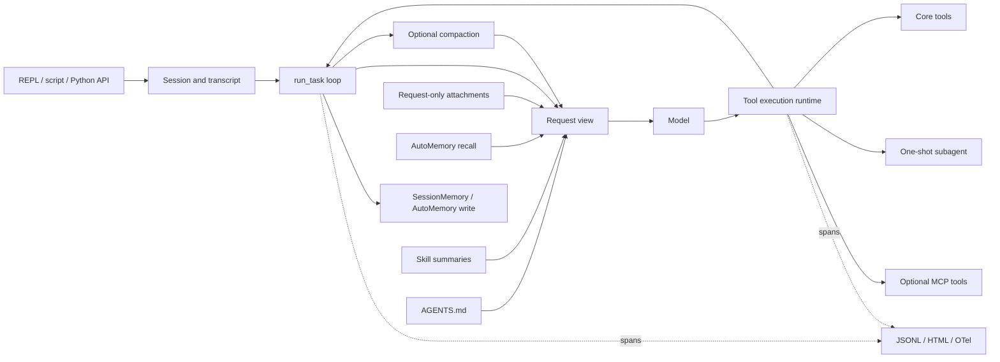

# Coding Agent Eval

[English](./README.md) | [简体中文](./README.zh-CN.md)

An observable and evaluable coding-agent harness for answering not only whether an agent succeeded, but why it succeeded or failed.

```text
run task -> inspect trace -> isolate failure mechanism -> add a regression/eval -> rerun
```

This repository combines a complete local coding-agent runtime with an independently built observability and evaluation stack. Some runtime module designs draw on publicly available Claude Code technical documentation and learning materials, then adapt and extend those ideas inside this project. The tracing and evaluation systems are project work built around OpenTelemetry, Phoenix, controlled experiments, and official benchmark harnesses.

## What is implemented

| Area | Current capability | Runtime state |
|---|---|---|
| Agent loop | Bounded model/tool turns, retry handling, hooks, permissions, durable transcripts, request-scoped context | Default |
| Tools and tasks | Shell, file operations, search, symbol search, todos, background commands, and persistent task graphs | Default |
| Sessions | Project-scoped create/resume, atomic transcript checkpoints, and per-session traces | Default in `ace` |
| Context management | Request-only attachments plus micro, full, pipeline, and SessionMemory compaction paths | Integrated; compaction is opt-in |
| Memory | SessionMemory checkpoints and cross-session AutoMemory recall/write; governance and consolidation libraries | Configurable |
| Skills | Project/user discovery, summary-first exposure, on-demand loading, and compact/resume restoration | Active when skills exist |
| Subagents | Isolated one-shot `Agent` tool with bounded turns and inherited safety controls | Default tool |
| MCP | Optional local stdio servers, permission checks, per-server isolation/recovery, and deferred schemas | Opt-in |
| Observability | Nested JSONL spans, usage/tool/context metadata, offline HTML viewer, and optional OTel/Phoenix export | Default in `ace` |
| Evaluation | Layered regression, context-compression, AutoMemory, and SWE-bench Verified workflows | Separate commands |

AutoDream, memory governance, and deterministic consolidation are implemented and tested library components. AutoDream is disabled by default and is not automatically started by the main loop.

## Evidence highlights

| Track | Recorded result | What the result demonstrates |
|---|---|---|
| Context compression | On a real continuous dependency chain, the cache-aware pipeline held peak context near **166–167K tokens**, versus **268,927 tokens** for the no-compaction/full-context condition; both conditions resolved two milestones on the fixed six-milestone workload | Compaction crossed the production trigger, prevented context growth beyond the model's practical window, and preserved the observed task outcome |
| AutoMemory | Four discriminating cross-session A/B cases produced **+0.60 to +1.00** recall delta; the scoped precision control remained **3/3 vs 3/3** | The harness separates memory write success, later recall, downstream use, and irrelevant-memory precision |
| SWE-bench Verified | A DeepSeek V4 Flash two-stage campaign reached **21/38 unique cases resolved** (`16/38` first pass + 5 new rescues); a later DeepSeek V4 Pro single pass resolved **19/38** and supported an official-artifact failure taxonomy | The project ran the official scorer, iterated on unresolved cases, and converted scores and traces into concrete harness fixes |
| Harness/model boundary | Full native Claude Code 2.1.207 with DeepSeek V4 Flash resolved **2/8** on a fixed hard slice; explicit max effort resolved **1/8** and rescued none of the six prior failures | A mature harness helps organize execution, but it does not replace model-level semantic understanding or convergence |

The Flash `21/38` number is cumulative campaign coverage, not a single-pass rate. All results are bounded experiment snapshots rather than leaderboard claims. See the [compression report](docs/evals/compression-report.md), [AutoMemory report](docs/evals/automemory-report.md), [SWE-bench practice report](docs/evals/swebench-verified-practice.md), and [evaluation overview](docs/evaluation.md).

## Quick start

Python 3.12 or newer is required.

```bash
python -m venv .venv
python -m pip install -e ".[test]"
```

Copy [`.env.example`](.env.example) to `.env`, or export the same variables in your shell:

```dotenv
ANTHROPIC_API_KEY=...
MODEL_ID=...
```

Start the interactive runtime or run one task:

```bash
ace
python scripts/run_task.py "Inspect this repository and summarize its test strategy." --workdir .
```

Runtime state defaults to `~/.ace`; traces default to `~/.ace/traces`. See [Reproducibility](docs/reproducibility.md) for installation, test, and release-gate details.

Optional MCP support is installed separately:

```bash
python -m pip install -e ".[mcp]"
ace --mcp-config examples/mcp/.mcp.json
```

## Architecture



Three boundaries are explicit: `ToolPool` owns the executable inventory, the per-turn request view controls schema exposure, and `ToolExecutionRuntime` validates, authorizes, executes, and records tool calls. Request assembly keeps query-scoped project/skill/memory context, durable transcript state, and request-only attachments separate. See [Runtime Architecture](docs/architecture.md).

## Evaluation hierarchy

| Layer | Question | Main evidence |
|---|---|---|
| L1: deterministic regression | Did a runtime or module contract break? | Offline unit/integration tests and mechanism gates |
| L2: targeted behavior evaluation | Did a mechanism change state retention, downstream behavior, or cost? | Compression and AutoMemory controlled experiments |
| L3: external benchmark | Did the agent satisfy the official task contract on a fixed suite? | SWE-bench predictions, official scorer artifacts, and repeat-N checking |

Run the developer gate after installing test dependencies:

```bash
python scripts/regression_gate.py offline
```

Inspect a trace locally:

```bash
python scripts/view_trace.py --list
python scripts/view_trace.py path/to/run.jsonl --output trace.html
```

Trace output is diagnostic evidence, not durable memory or a benchmark score. Content previews are disabled unless explicitly enabled.

For the optional OTel/Phoenix path—including live span export, the memory-eval
phase tree, annotations, and Dataset/Experiment comparison—follow the
[Phoenix workflow](docs/observability.md#run-the-phoenix-workflow).

## Current boundaries

- The top-level runtime is synchronous. The `Agent` tool runs one bounded child at a time; it is not a concurrent multi-agent scheduler and does not create worktrees.
- The REPL does not currently expose every compaction-strategy setting available through the programmatic and evaluation paths.
- AutoDream, memory governance, and consolidation are callable libraries rather than automatic query-lifecycle stages.
- MCP currently targets local stdio tools; resources, OAuth, remote transports, and production load testing are outside the current scope.
- Historical SWE-bench results are single-run or campaign diagnostics. The repeat-3 release baseline remains a separate paid run.

## Repository guide

- [`agent/`](agent/) — runtime, tools, context, memory, skills, subagents, tasks, MCP, and CLI
- [`obs/`](obs/) — trace schema, sinks, viewer, and optional OpenTelemetry export
- [`eval/`](eval/) — compression, memory, runtime, EvoClaw, and SWE-bench evaluation code
- [`tests/`](tests/) — deterministic unit and integration regressions; live tests are excluded by default
- [`docs/`](docs/) — bilingual architecture, observability, evaluation, provenance, and reproducibility documents

[Documentation](docs/README.md) · [License](LICENSE) · [Provenance](docs/provenance.md) · [Third-party notices](THIRD_PARTY_NOTICES.md) · [Contributing](CONTRIBUTING.md) · [Security](SECURITY.md)
