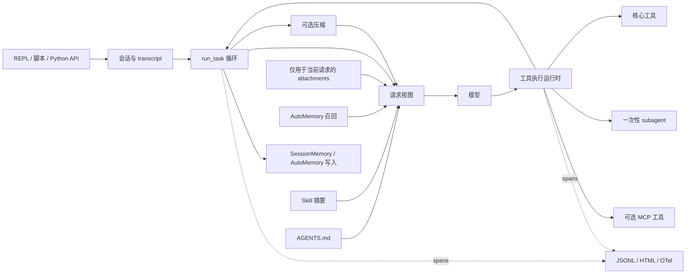

# Coding Agent Eval

[English](./README.md) | [简体中文](./README.zh-CN.md)

一个可观测、可评估的 coding agent harness：不仅回答 Agent 是否成功，还能解释它为何成功或失败。

```text
运行任务 -> 检查 trace -> 定位失败机制 -> 添加回归测试/评估 -> 重新运行
```

本仓库将完整的本地 coding agent 运行时与独立构建的可观测性和评估体系结合在一起。部分运行时模块设计借鉴了 Claude Code 公开的技术文档和学习资料，并在本项目中对相关思路进行了适配和扩展。Trace 与评估系统则是本项目围绕 OpenTelemetry、Phoenix、受控实验和官方 benchmark harness 独立完成的工程实践。

## 已实现能力

| 领域 | 当前能力 | 运行时状态 |
|---|---|---|
| Agent 循环 | 有界的模型/工具轮次、重试处理、hooks、权限、持久化 transcript、请求级上下文 | 默认启用 |
| 工具与任务 | Shell、文件操作、搜索、符号搜索、todos、后台命令和持久化任务图 | 默认启用 |
| 会话 | 项目级创建/恢复、原子 transcript checkpoint、逐会话 trace | 在 `ace` 中默认启用 |
| 上下文管理 | 仅用于当前请求的 attachments，以及 micro、full、pipeline 和 SessionMemory 压缩路径 | 已集成；压缩为可选功能 |
| 记忆 | SessionMemory checkpoint，以及跨会话 AutoMemory 召回/写入；治理与整合库 | 可配置 |
| Skills | 项目级/用户级发现、摘要优先暴露、按需加载，以及压缩/恢复后的状态还原 | 存在 skills 时启用 |
| Subagents | 隔离的一次性 `Agent` 工具，具有有界轮次并继承安全控制 | 默认工具 |
| MCP | 可选的本地 stdio servers、权限检查、逐 server 隔离/恢复，以及延迟 schema | 可选启用 |
| 可观测性 | 嵌套 JSONL spans、用量/工具/上下文元数据、离线 HTML viewer，以及可选的 OTel/Phoenix 导出 | 在 `ace` 中默认启用 |
| 评估 | 分层回归、上下文压缩、AutoMemory 和 SWE-bench Verified 工作流 | 通过独立命令运行 |

AutoDream、记忆治理和确定性整合均为已实现且经过测试的库组件。AutoDream 默认关闭，也不会由主循环自动启动。

## 核心证据

| 评估方向 | 已记录结果 | 结果说明 |
|---|---|---|
| 上下文压缩 | 在一条真实的连续依赖链上，缓存感知 pipeline 将上下文峰值控制在约 **166–167K tokens**，而无压缩/完整上下文条件达到 **268,927 tokens**；在固定的六里程碑工作负载上，两种条件均解决了两个里程碑 | 压缩越过了生产级触发阈值，避免上下文增长超出模型的实际窗口，同时保留了观测到的任务结果 |
| AutoMemory | 四个具备区分度的跨会话 A/B 用例产生了 **+0.60 到 +1.00** 的召回增量；限定作用域的精度对照保持为 **3/3 vs 3/3** | Harness 能够区分记忆写入是否成功、后续是否召回、是否被下游使用，以及无关记忆的精度 |
| SWE-bench Verified | DeepSeek V4 Flash 两阶段 campaign 共解决 **21/38 个不重复案例**（首轮 `16/38`，另新增 5 个 rescue）；后续 DeepSeek V4 Pro 单轮解决 **19/38**，并支持了基于官方产物的失败分类 | 项目实际运行了官方 scorer，围绕未解决案例进行迭代，并把评分与 trace 转化为具体的 harness 修复 |
| Harness/模型边界 | 完整原生 Claude Code 2.1.207 搭配 DeepSeek V4 Flash，在固定高难切片上解决 **2/8**；显式使用最高 effort 后解决 **1/8**，且此前六个失败案例无一被 rescue | 成熟的 harness 有助于组织执行，但不能替代模型层面的语义理解与收敛能力 |

Flash 的 `21/38` 是 campaign 的累计覆盖数，并非单轮通过率。所有结果都是有明确边界的实验快照，而非排行榜成绩声明。详见[压缩报告](docs/evals/compression-report.zh-CN.md)、[AutoMemory 报告](docs/evals/automemory-report.zh-CN.md)、[SWE-bench 实践报告](docs/evals/swebench-verified-practice.zh-CN.md)和[评估总览](docs/evaluation.zh-CN.md)。

## 快速开始

需要 Python 3.12 或更高版本。

```bash
python -m venv .venv
python -m pip install -e ".[test]"
```

将 [`.env.example`](.env.example) 复制为 `.env`，或在 shell 中导出相同变量：

```dotenv
ANTHROPIC_API_KEY=...
MODEL_ID=...
```

启动交互式运行时，或运行单个任务：

```bash
ace
python scripts/run_task.py "Inspect this repository and summarize its test strategy." --workdir .
```

运行时状态默认写入 `~/.ace`，trace 默认写入 `~/.ace/traces`。安装、测试和发布门禁的详细说明见[可复现性文档](docs/reproducibility.zh-CN.md)。

可选的 MCP 支持需要单独安装：

```bash
python -m pip install -e ".[mcp]"
ace --mcp-config examples/mcp/.mcp.json
```

## 架构



系统明确划分了三个边界：`ToolPool` 管理可执行工具清单；逐轮请求视图控制 schema 暴露；`ToolExecutionRuntime` 负责校验、授权、执行和记录工具调用。请求组装会把请求级的项目/skill/记忆上下文、持久化 transcript 状态和仅用于当前请求的 attachments 分离处理。详见[运行时架构](docs/architecture.zh-CN.md)。

## 评估层级

| 层级 | 核心问题 | 主要证据 |
|---|---|---|
| L1：确定性回归 | 运行时或模块契约是否被破坏？ | 离线单元/集成测试与机制门禁 |
| L2：定向行为评估 | 某项机制是否改变了状态保留、下游行为或成本？ | 上下文压缩与 AutoMemory 受控实验 |
| L3：外部 benchmark | Agent 是否在固定测试集上满足官方任务契约？ | SWE-bench predictions、官方 scorer 产物和 repeat-N 检查 |

安装测试依赖后，运行开发者门禁：

```bash
python scripts/regression_gate.py offline
```

在本地检查 trace：

```bash
python scripts/view_trace.py --list
python scripts/view_trace.py path/to/run.jsonl --output trace.html
```

Trace 输出是诊断证据，不是持久记忆，也不是 benchmark 分数。除非显式启用，否则内容预览处于关闭状态。

如需使用可选的 OTel/Phoenix 链路，包括实时 span 导出、memory-eval phase
树、annotations 以及 Dataset/Experiment 对比，请参照
[Phoenix 操作流程](docs/observability.zh-CN.md#运行-phoenix-操作流程)。

## 当前边界

- 顶层运行时为同步执行。`Agent` 工具每次运行一个有界子 Agent；它不是并发多 Agent 调度器，也不会创建 worktree。
- REPL 目前没有暴露通过程序化接口和评估路径可用的全部压缩策略设置。
- AutoDream、记忆治理和整合是可调用的库，而不是自动执行的查询生命周期阶段。
- MCP 当前面向本地 stdio 工具；resources、OAuth、远程 transports 和生产级压力测试不在当前范围内。
- 历史 SWE-bench 结果属于单轮实验或 campaign 诊断。repeat-3 发布基线仍是一次需要单独付费运行的实验。

## 仓库导览

- [`agent/`](agent/) — 运行时、工具、上下文、记忆、skills、subagents、任务、MCP 和 CLI
- [`obs/`](obs/) — trace schema、sinks、viewer 和可选的 OpenTelemetry 导出
- [`eval/`](eval/) — 上下文压缩、记忆、运行时、EvoClaw 和 SWE-bench 评估代码
- [`tests/`](tests/) — 确定性的单元与集成回归；默认排除 live tests
- [`docs/`](docs/) — 双语架构、可观测性、评估、来源说明和可复现性文档

[文档](docs/README.zh-CN.md) · [许可证](LICENSE) · [来源说明](docs/provenance.zh-CN.md) · [第三方声明](THIRD_PARTY_NOTICES.md) · [贡献指南](CONTRIBUTING.md) · [安全说明](SECURITY.md)
