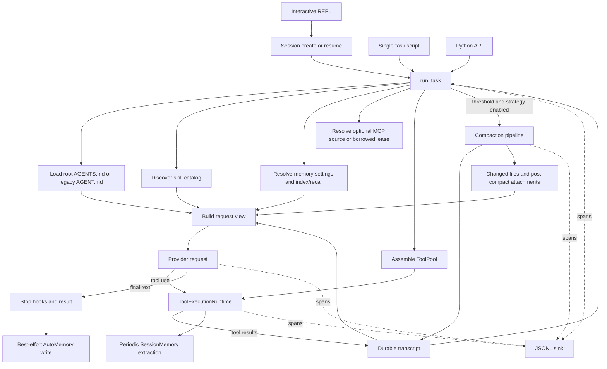

# Runtime Architecture

[English](architecture.md) | [简体中文](architecture.zh-CN.md)

This document maps the executed code path and distinguishes default runtime behavior from opt-in and library-only features.

## Entrypoints

| Entry | Call path | Persistence |
|---|---|---|
| `ace` / `python -m agent` | `agent.cli.repl` -> `Session.run()` -> `run_task()` | Transcript, SessionMemory notes, AutoMemory, and per-session trace |
| `scripts/run_task.py` | Script options -> `run_task()` | Trace only unless the caller adds persistence |
| Python API | `from agent.loop import run_task, EvalHooks` | Caller-owned |

`Session` is deliberately thin. It resolves project identity, owns the session store and memory instances, appends the new user message, calls the same loop used by evaluation harnesses, and atomically rewrites the complete JSONL transcript. A rewrite is necessary because compaction can replace earlier in-memory history; append-only persistence would retain stale pre-compaction messages.

## Local state and configuration

The package loads `.env` from the process launch directory without overriding
already-exported variables. Mutable defaults live below `ACE_HOME` (normally
`~/.ace`) rather than below the installed package: direct-call workspace state
uses `workspaces/default`, traces use `traces`, and project sessions/memory use
`projects/<stable-project-key>`. `AGENT_WORKDIR` and `TRACES_DIR` override the
first two paths. Session and evaluation entrypoints bind explicit workspaces,
so the fallback workspace applies only to direct callers that omit one.

This layout is not an automatic migration system. Existing repository-local
`workspace/` or `.traces/` data remains where it is until the operator moves it
or selects it through the corresponding environment override.

## End-to-end path

## Request state has three layers

The model request is assembled in a fixed order without mutating all inputs into one transcript:

1. Query-scoped context: project instructions, skill summaries, deferred-tool index, and optional memory index.
2. Durable transcript: user, assistant, tool, compact-summary, and trusted durable-marker messages.
3. Request-only attachments: changed-file state and one-shot post-compact restoration data.

This separation matters for resume and prompt caching. Project profiles and attachments can be resent without becoming conversation history, while the session store remains a faithful durable checkpoint. The concrete boundary is implemented by [`agent/context/request_view.py`](../agent/context/request_view.py) and [`agent/runtime/request_context.py`](../agent/runtime/request_context.py).

## Tool inventory, exposure, and execution are separate

| Layer | Responsibility |
|---|---|
| [`ToolPool`](../agent/tools/pool.py) | Immutable executable inventory: core tools, `Skill`, `Agent`, optional MCP tools, and `ToolSearch` when deferred schemas are enabled |
| Per-turn request view | Selects model-visible schemas and restores deferred-tool selection from durable markers |
| [`ToolExecutionRuntime`](../agent/tools/runtime.py) | Validates input, evaluates permissions and hooks, executes against the bound workspace, persists oversized results, emits spans, and returns transcript messages |

The execution runtime is built from the same pool and visibility state used for the provider request. Hidden or denied tools cannot be invoked simply because their Python implementation exists.

Core tools include shell/PowerShell, file read/write/edit, glob/grep/symbol search, todos, persistent task-graph operations, background-task output/stop, and the one-shot `Agent` tool. The task graph tracks dependencies and ownership; background tasks track local processes. They are related tools, not one workflow engine.

## Context management

[`agent/context/compact.py`](../agent/context/compact.py) implements token estimation, tool-pair repair, compact boundaries, micro-compaction, full model-generated summaries, combined pipelines, SessionMemory-based compaction, and emergency truncation/retry behavior. Post-compact cleanup restores bounded changed-file, skill, and deferred-tool state as request-only attachments.

Compaction is present on the `run_task()` path, but `EvalHooks.compact_strategy` defaults to `none`. The single-task script exposes the strategy and thresholds; the interactive REPL currently does not. This distinction prevents an implemented evaluation mechanism from being misreported as default REPL behavior.

The small deterministic budget implementation under [`eval/context_eval/`](../eval/context_eval/) is an evaluation instrument. It is not a second production context manager.

## Memory lifecycle

Two memory scopes are attached by default when the REPL creates a session:

| Component | Scope | Runtime role |
|---|---|---|
| SessionMemory | One session | Periodically extracts a structured working checkpoint after tool activity; can replace a full-summary call during the opt-in compaction strategy |
| AutoMemory | One project across sessions | Exposes either an index snapshot or selector recall and performs a best-effort write after a completed query loop |

AutoMemory can be disabled or switched between index and selector recall through merged settings. Recalled memory is represented as typed attachment state and is excluded from transcript persistence where appropriate. Memory file access receives an additional, bounded capability rather than widening general workspace access.

Governance CRUD, health inspection, deterministic consolidation, and AutoDream are implemented under [`agent/memory/`](../agent/memory/). AutoDream requires an explicitly enabled configuration and is not started by `run_task()` or `Session`.

## Skills and subagents

Skills are discovered from project and user directories. Only names and descriptions are placed in the initial request; the model must call `Skill` to load the complete `SKILL.md`. Loaded skill bodies are tracked per run and restored after compaction or resume within a bounded budget.

`Agent` runs a fresh, synchronous child with a bounded turn count. It receives an isolated message history and a filtered tool pool, inherits permissions/hooks and workspace execution boundaries, and cannot recursively spawn another `Agent`. There is no parallel scheduler or automatic worktree isolation in the current implementation.

## MCP ownership

MCP is optional and currently stdio-only. A direct `run_task()` call owns and closes its source. The REPL owns an [`McpConnectionManager`](../agent/mcp/connection_manager.py) across sequential queries and lends the loop a lease. Servers are tracked independently so one initialization or call failure does not erase healthy definitions; configuration changes invalidate only affected connections and retry delay is bounded.

Deferred schema discovery exposes `ToolSearch` plus non-deferred tools first, then makes selected MCP schemas visible on the next turn. Selection markers can survive resume and compaction.

## Observability

The loop, provider seam, hooks, permissions, context management, subagents, background tasks, MCP, and tool execution emit nested spans. The interactive CLI owns a tee sink that writes one JSONL stream per session and renders action lines; single-task runs create an independent trace. Sink failures are best-effort and do not terminate the coding task.

Trace content previews are opt-in. Session transcripts, memory files, evaluation artifacts, and traces are separate data products with different retention and claim boundaries.

## Capability boundary

| State | Components |
|---|---|
| Default hot path | Loop, sessions, tools, permissions, hooks, project profile, skills, `Agent`, tasks/background notifications, tracing, SessionMemory, AutoMemory |
| Opt-in hot path | MCP, deferred MCP schemas, compaction strategies, OTel export, selector memory recall |
| Tested library | AutoDream, memory governance/consolidation |
| Evaluation-only | Deterministic context-budget instrument, model A/B harnesses, compression probes, benchmark adapters/checkers |
| Not implemented | Concurrent multi-agent scheduling, worktree isolation, a general plugin platform, MCP resources/OAuth/remote transports |
