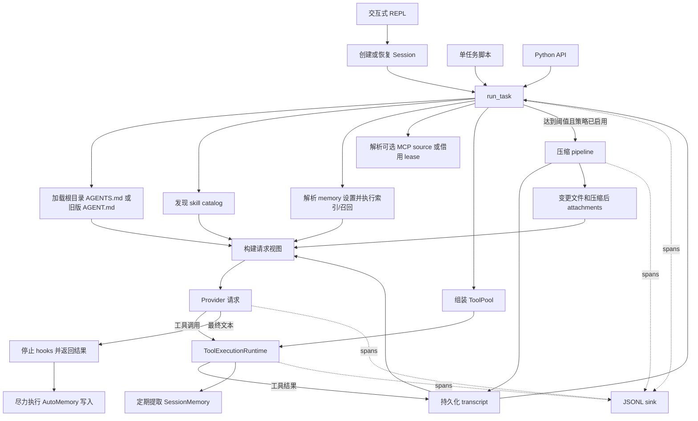

# 运行时架构

[English](./architecture.md) | [简体中文](./architecture.zh-CN.md)

本文档梳理实际执行的代码路径，并区分默认运行时行为、可选启用功能和仅作为库提供的功能。

## 入口

| 入口 | 调用路径 | 持久化行为 |
|---|---|---|
| `ace` / `python -m agent` | `agent.cli.repl` -> `Session.run()` -> `run_task()` | Transcript、SessionMemory notes、AutoMemory 和逐会话 trace |
| `scripts/run_task.py` | 脚本选项 -> `run_task()` | 除非调用方另行添加持久化，否则仅记录 trace |
| Python API | `from agent.loop import run_task, EvalHooks` | 由调用方负责 |

`Session` 被有意设计为一个轻量封装。它解析项目标识，持有 session store 和 memory 实例，追加新的用户消息，调用与评估 harness 相同的循环，并以原子方式重写完整的 JSONL transcript。之所以必须重写，是因为压缩可能替换内存中更早的历史记录；仅追加式持久化会保留压缩前的陈旧消息。

## 本地状态与配置

包会从进程启动目录加载 `.env`，但不会覆盖已导出的环境变量。可变状态默认存放在 `ACE_HOME`（通常为 `~/.ace`）之下，而不是已安装包的目录中：直接调用时的 workspace 状态使用 `workspaces/default`，trace 使用 `traces`，项目会话和记忆使用 `projects/<stable-project-key>`。`AGENT_WORKDIR` 和 `TRACES_DIR` 分别覆盖前两个路径。Session 和评估入口会绑定显式 workspace，因此 fallback workspace 只适用于未指定 workspace 的直接调用方。

这一目录布局并不是自动迁移系统。已有的仓库本地 `workspace/` 或 `.traces/` 数据会保留在原处，直到操作者手动移动，或通过对应的环境变量覆盖项选择它们。

## 端到端路径

## 请求状态分为三层

模型请求按照固定顺序组装，不会把所有输入都改写进同一个 transcript：

1. 请求级上下文：项目指令、skill 摘要、延迟工具索引，以及可选的记忆索引。
2. 持久化 transcript：用户、assistant、工具、压缩摘要和可信的持久标记消息。
3. 仅用于当前请求的 attachments：变更文件状态，以及压缩后的一次性恢复数据。

这种分层对恢复会话和 prompt caching 都很重要。项目 profile 和 attachments 可以重新发送而不成为对话历史，同时 session store 仍然是可信的持久 checkpoint。具体边界由 [`agent/context/request_view.py`](../agent/context/request_view.py) 和 [`agent/runtime/request_context.py`](../agent/runtime/request_context.py) 实现。

## 工具清单、暴露与执行相互分离

| 层级 | 职责 |
|---|---|
| [`ToolPool`](../agent/tools/pool.py) | 不可变的可执行工具清单：核心工具、`Skill`、`Agent`、可选 MCP 工具，以及启用延迟 schema 时的 `ToolSearch` |
| 逐轮请求视图 | 选择模型可见的 schemas，并从持久标记中恢复延迟工具选择状态 |
| [`ToolExecutionRuntime`](../agent/tools/runtime.py) | 校验输入、评估权限和 hooks、针对绑定的 workspace 执行操作、持久化超大结果、发出 spans，并返回 transcript 消息 |

执行运行时由 provider 请求所使用的同一个工具池和可见性状态构建。某个工具即使存在 Python 实现，只要被隐藏或拒绝，就不能被调用。

核心工具包括 shell/PowerShell、文件读/写/编辑、glob/grep/符号搜索、todos、持久化任务图操作、后台任务输出/停止，以及一次性的 `Agent` 工具。任务图追踪依赖关系和所有权；后台任务追踪本地进程。它们是相互关联的工具，但并不是同一个工作流引擎。

## 上下文管理

[`agent/context/compact.py`](../agent/context/compact.py) 实现了 token 估算、工具消息配对修复、压缩边界、micro-compaction、由模型生成完整摘要的 full compaction、组合 pipeline、基于 SessionMemory 的压缩，以及紧急截断/重试行为。压缩后的清理过程会把有界的变更文件、skill 和延迟工具状态恢复为仅用于当前请求的 attachments。

压缩位于 `run_task()` 路径上，但 `EvalHooks.compact_strategy` 默认为 `none`。单任务脚本会暴露压缩策略和阈值；交互式 REPL 目前不会。明确这一区别，可以避免把已经实现的评估机制误报为 REPL 默认行为。

[`eval/context_eval/`](../eval/context_eval/) 下的小型确定性预算实现是一项评估工具，并不是第二套生产级上下文管理器。

## 记忆生命周期

REPL 创建 session 时默认挂载两种作用域的记忆：

| 组件 | 作用域 | 运行时角色 |
|---|---|---|
| SessionMemory | 单个 session | 在工具活动后定期提取结构化工作 checkpoint；在可选的压缩策略中，可以替代一次完整摘要调用 |
| AutoMemory | 跨 session 的单个项目 | 暴露索引快照或 selector 召回，并在查询循环完成后尽力执行写入 |

可以通过合并后的设置关闭 AutoMemory，或在 index 与 selector recall 之间切换。召回的记忆以带类型的 attachment 状态表示，并在适当情况下排除在 transcript 持久化之外。记忆文件访问获得的是额外且有界的能力，而不是扩大通用 workspace 的访问范围。

治理 CRUD、健康检查、确定性整合和 AutoDream 均已在 [`agent/memory/`](../agent/memory/) 下实现。AutoDream 需要显式启用的配置，且不会由 `run_task()` 或 `Session` 启动。

## Skills 与 subagents

系统从项目目录和用户目录发现 skills。初始请求中只放入名称与描述；模型必须调用 `Skill` 才能加载完整的 `SKILL.md`。已加载的 skill 内容按每次运行追踪，并在压缩或恢复后于有界预算内还原。

`Agent` 会运行一个全新、同步且轮次有界的子 Agent。它拥有隔离的消息历史和经过筛选的工具池，继承权限/hooks 与 workspace 执行边界，并且不能递归生成另一个 `Agent`。当前实现不包含并行调度器或自动 worktree 隔离。

## MCP 所有权

MCP 是可选功能，目前仅支持 stdio。直接调用 `run_task()` 时，由调用方持有并关闭其 source。REPL 会在连续查询之间持有一个 [`McpConnectionManager`](../agent/mcp/connection_manager.py)，并把 lease 借给循环。各 server 独立追踪，因此单个 server 初始化或调用失败不会清除健康的定义；配置变更只会使受影响的连接失效，重试延迟也有上限。

延迟 schema 发现会先暴露 `ToolSearch` 和非延迟工具，再在下一轮让选中的 MCP schemas 可见。选择标记可以跨会话恢复和压缩保留。

## 可观测性

循环、provider seam、hooks、权限、上下文管理、subagents、后台任务、MCP 和工具执行都会发出嵌套 spans。交互式 CLI 持有一个 tee sink，为每个 session 写入一条 JSONL 流并渲染操作行；单任务运行则创建独立 trace。Sink 失败采用 best-effort 处理，不会终止 coding task。

Trace 内容预览为可选功能。Session transcripts、记忆文件、评估产物和 traces 是彼此独立的数据产品，拥有不同的保留策略与结论边界。

## 能力边界

| 状态 | 组件 |
|---|---|
| 默认 hot path | 循环、sessions、工具、权限、hooks、项目 profile、skills、`Agent`、任务/后台通知、tracing、SessionMemory、AutoMemory |
| 可选 hot path | MCP、延迟 MCP schemas、压缩策略、OTel 导出、selector memory recall |
| 已测试的库 | AutoDream、记忆治理/整合 |
| 仅用于评估 | 确定性上下文预算工具、模型 A/B harnesses、压缩 probes、benchmark adapters/checkers |
| 尚未实现 | 并发多 Agent 调度、worktree 隔离、通用 plugin 平台、MCP resources/OAuth/远程 transports |
