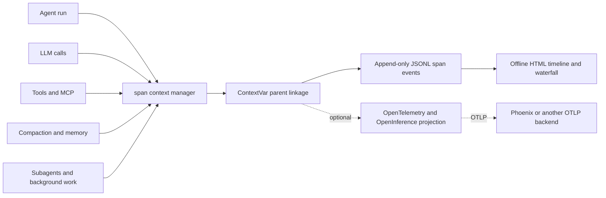

# Observability

[English](./observability.md) | [简体中文](./observability.zh-CN.md)

The observability plane turns an agent run into inspectable evidence: which
turn made a decision, which tool changed the repository, where an error
entered the run, what patch was produced, and whether the official evaluator
accepted it.

This is an independently designed project component. It follows general open
observability conventions—OpenTelemetry span semantics, OpenInference-compatible
attributes, and optional Arize Phoenix export. It is separate from the Claude
Code design references used by selected agent-runtime modules.

## Terms

| Term | Meaning in this project |
|---|---|
| Span | One timed runtime operation with status, attributes, and an optional parent. |
| Trace | All spans that share one `trace_id`; parent links reconstruct the run as a tree. |
| False-green | The agent's own validation reports success, but the official benchmark still reports unresolved. |
| Official score | A verdict produced by the external benchmark harness, not by this tracing system. |

## Architecture



[`span()`](../obs/trace.py) creates or reuses a trace ID, reads the ambient
parent span from a `ContextVar`, and restores the previous context on exit.
Nested calls therefore acquire `parent_span_id` without passing span objects
through business-layer function signatures. `capture_context()` carries the
same linkage into background threads and subagent work.

Each completed span is appended as one JSON object by `JsonlSink`. The sink is
thread-safe and best-effort: an encoding or write failure increments a
`dropped` counter instead of crashing the agent. The event stream can be
projected in two directions:

- [`obs/viewer.py`](../obs/viewer.py) reconstructs the tree and produces a
  self-contained HTML turn timeline, context/cache panel, and span waterfall.
- [`obs/otel.py`](../obs/otel.py) optionally mirrors the same operations into
  OpenTelemetry spans, adds OpenInference-compatible model/tool attributes,
  and exports them to Phoenix or another OTLP endpoint. The agent still runs
  when these optional packages are absent.

The important runtime seams include `agent.run`, `agent.turn`, `llm.call`,
`tool.*`, `mcp.*`, `compact.*`, `memory.*`, subagent calls, and background
tasks. This keeps tracing cross-cutting rather than tied to one feature.

## Run the Phoenix workflow

The commands below were rechecked with Phoenix 17.9.0 on Python 3.12. Install
the lightweight OTLP exporter and the heavier local backend through explicit
extras:

```powershell
python -m pip install -e ".[otel,phoenix]"
python scripts/start_phoenix.py
```

Keep that terminal running. In a second PowerShell window, bypass any proxy for
the local API, send a zero-LLM smoke trace, and open the UI:

```powershell
$env:NO_PROXY = "localhost,127.0.0.1"
python scripts/phoenix_smoke.py
# open http://localhost:6006 and select project "coding-agent-eval"
```

To export a real agent run through the same bridge:

```powershell
$env:OTEL_EXPORT = "1"
$env:OTEL_ENDPOINT = "http://localhost:6006/v1/traces"
python scripts/run_task.py "Inspect this repository and summarize its test strategy." --workdir .
```

The expected tree begins with `agent.run`, nests `agent.turn`, `llm.call`, and
`tool.*` spans, and exposes model, token, latency, tool, context, and status
attributes where available. The JSONL/HTML path remains available when Phoenix
or the optional OTel packages are absent.

### Review a long-term-memory experiment

The AutoMemory runner exports native sample spans into the `memory-eval`
project. It does not create a synthetic summary trace after the fact: each arm
has a real root span, and the S1 setup, write gate, fresh S2 probe, grader, LLM,
and tool work remain nested underneath it.

The next command calls the configured agent and judge models and may incur API
cost. It is not part of the offline release gate.

```powershell
python eval/memory/run.py --smoke
$run = Get-ChildItem eval/memory/results/*.jsonl | Sort-Object LastWriteTime | Select-Object -Last 1
python eval/memory/to_phoenix.py --jsonl $run.FullName
python eval/memory/aggregate_phoenix.py --jsonl $run.FullName
```

Use the three Phoenix surfaces for different questions:

| Surface | What to inspect |
|---|---|
| Project -> Traces | One sample waterfall: `memory_eval.<case>.<arm>.run<n>`, S1/S2 phase boundaries, write/recall evidence, runtime errors, tokens, and latency. |
| Span -> Annotations | `memory_eval_grader` for the machine verdict and `memory_eval_packet` for the self-contained intent, setup, probe, rule, answer, and ground-truth evidence packet. |
| Dataset -> Experiments -> Compare | Treatment/control rows and batch-level comparison across cases or runs. |

The projection deliberately separates three facts that are easy to conflate:
an evaluation `FAIL`, whether that result was expected for the control arm,
and whether the runtime itself ended in `ERROR`. A live `H_usr` integration
check matched and annotated **2/2** native root spans: the memory arm passed,
the no-memory arm failed as expected, and both root spans remained runtime
`OK`. This was a `k=1` observability acceptance check, not a stable memory
quality estimate; the capability results come from the repeated A/B report.
The sanitized acceptance record is
[automemory-phoenix-validation.json](evals/evidence/automemory-phoenix-validation.json).

Phoenix object IDs are local to its database. Hard-coding the maintainer's
`localhost` dataset IDs would produce dead links for GitHub readers, so the
repository commits the aggregate evidence and the commands that print the
current project and experiment URLs instead. Raw traces and the Phoenix data
store remain local because they may contain model, task, or repository content.

## Content and privacy boundary

Tool, MCP, skill, subagent, and background-task payloads use structure-only
summaries by default. Raw tool arguments and outputs are not stored as preview
fields unless content tracing is explicitly enabled through
[`agent/runtime/observability.py`](../agent/runtime/observability.py):

| `ACE_TRACE_CONTENT` | Behavior |
|---|---|
| `safe` (default) | Record type, field names, sizes, counts, status, and bounded operational metadata; no raw tool preview. |
| `redacted` | Add bounded previews after known credential patterns are redacted. |
| `raw` | Add bounded raw previews for local debugging only. |

`ACE_TRACE_PREVIEW_CHARS` controls the preview bound. Traces should still be
treated as sensitive artifacts: LLM spans contain bounded input/output snippets,
and redaction is a safeguard rather than proof that arbitrary text is secret-free.
Raw traces are therefore excluded from the public repository.

## Trace-to-patch-to-score diagnosis

The trace is useful because it is joined with artifacts outside the trace:

```text
turn and tool spans
  -> final repository patch
  -> agent-side validation signal
  -> official report.json and test_output.txt
  -> root-cause bucket
  -> runtime, tool, prompt, or evaluator change
  -> regression or benchmark re-check
```

The official harness remains the outcome authority. A green tool span, a
successful local test, or a clean HTML waterfall is diagnostic evidence—not a
benchmark score. Conversely, an unresolved score is not enough for a useful
engineering decision until the trace and patch show where the failure entered.

## Findings enabled by the trace plane

| Finding | What the joined evidence showed | Decision |
|---|---|---|
| False-green validation | Several patches ended with an agent-side `PASS` while the official FAIL_TO_PASS tests still failed. The trace separated “no validation” from “validation covered the wrong behavior.” | Stop treating local green as resolved; inspect the final patch and official test output. See the [SWE-bench practice report](evals/swebench-verified-practice.md). |
| Windows edit transport failure | In a five-instance diagnostic slice, structured edits exposed `[WinError 206]` in 5/5 runs because full-file base64 content was placed in `docker exec` argv. Moving content to byte-exact stdin reduced that error to 0/5, increased structured partial-edit adoption from 1/5 to 5/5, and removed shell source-write fallback from 5/5 to 0/5. | Fix the transport layer instead of tuning the model or prompt. The gold-valid official diagnostic moved from 1/4 to 3/4; this was `k=1` evidence, not a benchmark-wide rate claim. |
| Long-context pressure and task outcome | Context spans showed the full-context condition growing to 268,927 estimated tokens while the cache-aware pipeline stayed near 166,400. Joining those traces with the external grader showed two resolved milestones in both conditions. | Treat full compaction as the window-pressure valve and measure peak context together with task outcome. The separate 620K-to-236K fresh-input observation remains a cache-policy debugging note, not the headline result. See the [compression report](evals/compression-report.md). |
| Long-term-memory A/B attribution | Native sample traces separated S1 teaching, the write gate, fresh S2 recall, and grading; Phoenix annotations joined the verdict with the evidence packet instead of treating a memory file as proof of useful recall. | Diagnose extraction/write failures separately from recall/application failures, and keep expected control `FAIL` distinct from runtime `ERROR`. See the [AutoMemory report](evals/automemory-report.md). |

These rows are experiment snapshots recorded while the runtime continued to
evolve. Their value is the reproducible diagnosis and engineering decision,
not a claim that every number describes the current head revision.

## Boundaries and verification

- JSONL and Phoenix are two projections of the same span lifecycle; Phoenix is
  optional and is not the source of benchmark truth.
- Full-fidelity traces can leak task or repository content and are deliberately
  kept local.
- The viewer is an offline debugging surface, not a production monitoring or
  retention service.
- The current sink is process-global. A caller running multiple concurrent
  sessions in one process must manage sink ownership explicitly.
- Trace completeness is tested, but a dropped span can still occur under I/O
  failure; `dropped` makes that degradation visible.

Mechanism coverage lives in
[`tests/test_trace.py`](../tests/test_trace.py),
[`tests/test_viewer.py`](../tests/test_viewer.py), and
[`tests/test_runtime_observability.py`](../tests/test_runtime_observability.py).
