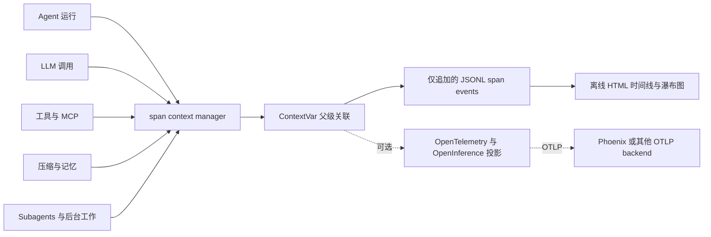

# 可观测性

[English](./observability.md) | [简体中文](./observability.zh-CN.md)

可观测层把一次 Agent 运行转化为可检查的证据：哪一轮做出了某项决策，哪个工具修改了仓库，错误从何处进入运行过程，最终生成了什么 patch，以及官方 evaluator 是否接受了它。

这是本项目独立设计的组件。它遵循通用的开源可观测性约定，包括 OpenTelemetry span 语义、与 OpenInference 兼容的 attributes，以及可选的 Arize Phoenix 导出。它与部分 Agent 运行时模块所借鉴的 Claude Code 设计资料相互独立。

## 术语

| 术语 | 在本项目中的含义 |
|---|---|
| Span | 一次带有状态、attributes 和可选 parent 的计时运行时操作。 |
| Trace | 共享同一个 `trace_id` 的全部 spans；通过 parent links 可将一次运行重建为树。 |
| 假绿（False-green） | Agent 自己的验证报告成功，但官方 benchmark 仍判定为未解决。 |
| 官方评分（Official score） | 由外部 benchmark harness 生成的判定，而不是由本 tracing system 生成。 |

## 架构



[`span()`](../obs/trace.py) 会创建或复用 trace ID，从 `ContextVar` 读取当前环境中的 parent span，并在退出时恢复此前的上下文。因此，嵌套调用无需在业务层函数签名中传递 span 对象，也能获得 `parent_span_id`。`capture_context()` 会把相同的关联关系带入后台线程和 subagent 工作。

每个完成的 span 都由 `JsonlSink` 追加为一个 JSON 对象。该 sink 是线程安全且 best-effort 的：编码或写入失败时只会增加 `dropped` 计数器，而不会让 Agent 崩溃。Event stream 可以向两个方向投影：

- [`obs/viewer.py`](../obs/viewer.py) 重建树结构，并生成自包含的 HTML 轮次时间线、上下文/cache 面板和 span 瀑布图。
- [`obs/otel.py`](../obs/otel.py) 可以把相同操作镜像为 OpenTelemetry spans，补充与 OpenInference 兼容的模型/工具 attributes，并导出到 Phoenix 或其他 OTLP endpoint。即使未安装这些可选依赖包，Agent 仍可正常运行。

关键的运行时切面包括 `agent.run`、`agent.turn`、`llm.call`、`tool.*`、`mcp.*`、`compact.*`、`memory.*`、subagent 调用和后台任务。这样，tracing 就是一项横切能力，而不是绑定于某个功能。

## 运行 Phoenix 操作流程

以下命令已在 Python 3.12 和 Phoenix 17.9.0 上复核。轻量 OTLP exporter
与依赖更重的本地后端通过显式 extras 安装：

```powershell
python -m pip install -e ".[otel,phoenix]"
python scripts/start_phoenix.py
```

保持该终端运行。在第二个 PowerShell 窗口中绕过本地 API 的代理，发送一条
不调用 LLM 的 smoke trace，然后打开 UI：

```powershell
$env:NO_PROXY = "localhost,127.0.0.1"
python scripts/phoenix_smoke.py
# 打开 http://localhost:6006，选择项目 "coding-agent-eval"
```

如需通过同一桥接导出真实 Agent 运行：

```powershell
$env:OTEL_EXPORT = "1"
$env:OTEL_ENDPOINT = "http://localhost:6006/v1/traces"
python scripts/run_task.py "Inspect this repository and summarize its test strategy." --workdir .
```

预期的 trace 树以 `agent.run` 开始，嵌套 `agent.turn`、`llm.call` 和
`tool.*` spans，并在可用时显示模型、token、延迟、工具、上下文和状态属性。
即使没有 Phoenix 或可选 OTel packages，JSONL/HTML 路径仍可使用。

### 审阅长期记忆实验

AutoMemory runner 会把原生样本 spans 导出到 `memory-eval` 项目。它不是在
实验结束后伪造一条扁平 summary trace：每个实验臂都有真实 root span，S1
设置、写入门禁、全新 S2 probe、grader、LLM 和工具工作都嵌套在其下。

下一条命令会调用已配置的 Agent 与 judge 模型，可能产生 API 费用；它不属于
离线发布门禁。

```powershell
python eval/memory/run.py --smoke
$run = Get-ChildItem eval/memory/results/*.jsonl | Sort-Object LastWriteTime | Select-Object -Last 1
python eval/memory/to_phoenix.py --jsonl $run.FullName
python eval/memory/aggregate_phoenix.py --jsonl $run.FullName
```

三个 Phoenix 界面回答不同问题：

| 界面 | 检查内容 |
|---|---|
| Project -> Traces | 单样本瀑布图：`memory_eval.<case>.<arm>.run<n>`、S1/S2 phase 边界、写入/召回证据、运行错误、token 与延迟。 |
| Span -> Annotations | `memory_eval_grader` 给出机器判定；`memory_eval_packet` 给出自包含的意图、设置、probe、规则、回答与 ground-truth 证据包。 |
| Dataset -> Experiments -> Compare | 处理组/对照组行，以及跨用例或跨批次的比较。 |

该投影刻意区分三个容易混淆的事实：评估 `FAIL`、该结果是否符合对照组预期，
以及运行时本身是否以 `ERROR` 结束。一次 `H_usr` live 集成验收匹配并标注了
**2/2** 条原生 root spans：记忆组通过、无记忆组按预期失败，同时两个 root
spans 的运行状态均为 `OK`。这是 `k=1` 的可观测链路验收，不是稳定的记忆
质量估计；能力结论来自重复 A/B 报告。
脱敏后的验收记录见
[automemory-phoenix-validation.json](evals/evidence/automemory-phoenix-validation.json)。

Phoenix object ID 只在对应数据库中有效。若把维护者本机的 `localhost`
dataset ID 硬编码进仓库，GitHub 读者得到的只会是死链接。因此，仓库提交聚合
证据与能够打印当前 project/experiment URL 的命令。原始 traces 和 Phoenix
数据目录保留在本地，因为其中可能包含模型、任务或仓库内容。

## 内容与隐私边界

工具、MCP、skill、subagent 和后台任务的 payload 默认只记录结构化摘要。除非通过 [`agent/runtime/observability.py`](../agent/runtime/observability.py) 显式启用内容追踪，否则不会把原始工具参数和输出存为 preview fields：

| `ACE_TRACE_CONTENT` | 行为 |
|---|---|
| `safe`（默认） | 记录类型、字段名、大小、数量、状态和有界的运行元数据；不记录原始工具 preview。 |
| `redacted` | 在脱敏已知凭据模式后，添加有界 preview。 |
| `raw` | 添加有界的原始 preview，仅供本地调试。 |

`ACE_TRACE_PREVIEW_CHARS` 控制 preview 上限。Trace 仍应被视为敏感产物：LLM spans 包含有界的输入/输出片段，脱敏只是安全措施，并不能证明任意文本都不含秘密。因此，原始 traces 不会纳入公开仓库。

## 从 trace 到 patch 再到评分的诊断

Trace 的价值来自它能够与 trace 之外的产物关联起来：

```text
轮次与工具 spans
  -> 最终仓库 patch
  -> Agent 侧验证信号
  -> 官方 report.json 与 test_output.txt
  -> 根因分类
  -> 运行时、工具、prompt 或 evaluator 变更
  -> 回归或 benchmark 复检
```

结果判定仍以官方 harness 为准。绿色的工具 span、成功的本地测试或干净的 HTML 瀑布图都只是诊断证据，并不是 benchmark 分数。反过来，如果不结合 trace 与 patch 判断失败从何处进入，仅有一个 unresolved 分数也不足以支持有价值的工程决策。

## Trace 层支持的发现

| 发现 | 关联证据揭示的结论 | 决策 |
|---|---|---|
| 假绿验证 | 多个 patch 最终得到 Agent 侧 `PASS`，但官方 FAIL_TO_PASS tests 仍然失败。Trace 区分了“没有验证”和“验证覆盖了错误行为”两种情况。 | 不再把本地绿色结果当作 resolved；检查最终 patch 和官方测试输出。详见 [SWE-bench 实践报告](evals/swebench-verified-practice.zh-CN.md)。 |
| Windows 编辑传输失败 | 在五实例诊断切片中，由于完整文件的 base64 内容被放入 `docker exec` argv，结构化编辑在 5/5 次运行中暴露了 `[WinError 206]`。将内容改为通过字节精确的 stdin 传输后，该错误从 5/5 降至 0/5，结构化局部编辑的采用率从 1/5 提升到 5/5，同时通过 shell 写入源文件的 fallback 从 5/5 降至 0/5。 | 修复传输层，而不是调整模型或 prompt。gold-valid 官方诊断结果从 1/4 提升到 3/4；这是 `k=1` 证据，并非 benchmark 全局通过率声明。 |
| 长上下文压力与任务结果 | 上下文 spans 显示，完整上下文条件增长到 268,927 个估算 tokens，而缓存感知 pipeline 保持在约 166,400。将这些 traces 与外部 grader 关联后可见，两种条件均解决了两个里程碑。 | 将 full compaction 视为窗口压力释放阀，并把上下文峰值与任务结果放在一起衡量。另一个 fresh-input 从 620K 降至 236K 的观察仍属于 cache policy 调试记录，而非核心结果。详见[压缩报告](evals/compression-report.zh-CN.md)。 |
| 长期记忆 A/B 归因 | 原生样本 traces 将 S1 teaching、写入门禁、全新 S2 召回和评分分开；Phoenix annotations 把判定与证据包关联，而不是把记忆文件的存在当成有效召回的证明。 | 分开诊断提取/写入失败与召回/应用失败，并把符合预期的对照组 `FAIL` 与运行时 `ERROR` 区分。详见 [AutoMemory 报告](evals/automemory-report.zh-CN.md)。 |

这些行记录的是运行时持续演进过程中的实验快照。它们的价值在于可复现的诊断与工程决策，而不是声称每个数字都描述当前 head revision。

## 边界与验证

- JSONL 与 Phoenix 是同一 span 生命周期的两种投影；Phoenix 是可选功能，也不是 benchmark 结论的事实来源。
- 完整内容的 traces 可能泄露任务或仓库内容，因此会被有意保留在本地。
- Viewer 是离线调试界面，并非生产级监控或数据保留服务。
- 当前 sink 是进程全局的。在同一进程内并发运行多个 sessions 的调用方必须显式管理 sink 所有权。
- Trace 完整性经过测试，但 I/O 失败时仍可能丢失 span；`dropped` 会让这种降级可见。

机制覆盖位于 [`tests/test_trace.py`](../tests/test_trace.py)、[`tests/test_viewer.py`](../tests/test_viewer.py) 和 [`tests/test_runtime_observability.py`](../tests/test_runtime_observability.py)。
